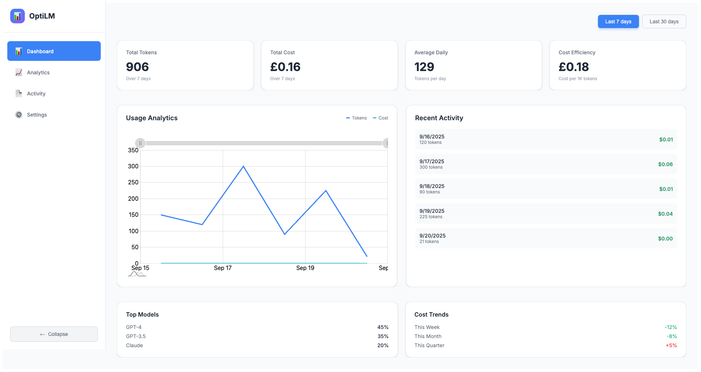
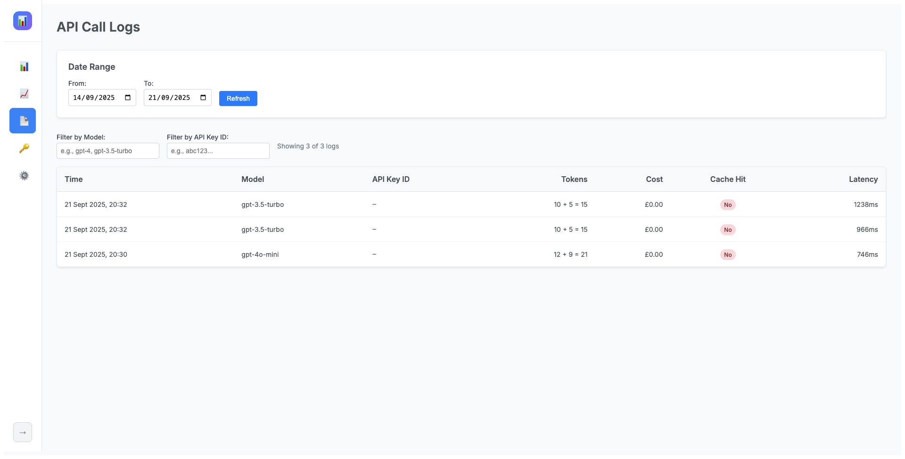
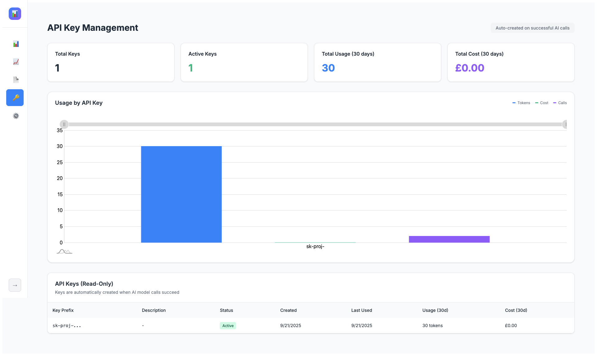

# opti-lm

**opti-lm** · Microservices Architecture for **optimizing LLM usage costs**

[](https://github.com/rpgeeganage/opti-lm/actions/workflows/ci.yml)
[](https://github.com/rpgeeganage/opti-lm/releases)
[](./LICENSE)

## 📋 Table of Contents

- [📌 About](#-about)
- [✨ Features (Phase-1)](#-features-phase-1)
- [🚀 Quickstart (Local Dev)](#-quickstart-local-dev)
  - [Database UIs](#database-uis)
- [🖥️ Dashboard](#-dashboard)
  - [📸 Screenshots](#-screenshots)
  - [🎯 Key Features](#-key-features)
  - [📊 Dashboard Sections](#-dashboard-sections)
  - [🚀 Running the Dashboard](#-running-the-dashboard)
  - [🎨 UI Features](#-ui-features)
  - [📱 Navigation](#-navigation)
- [🔐 API Key Management](#-api-key-management)
  - [🔒 Hash-Based Lookup System](#-hash-based-lookup-system)
  - [🎯 Key Features](#-key-features-1)
  - [📊 API Key Analytics](#-api-key-analytics)
- [🧪 Test the Proxy](#-test-the-proxy)
- [🔧 Technical Implementation](#-technical-implementation)
  - [API Key Security](#api-key-security)
- [🏗️ Architecture](#️-architecture)
- [📜 Roadmap](#-roadmap)
- [🤝 Contributing](#-contributing)
- [🔒 Security](#-security)
- [⚖️ License](#️-license)

---

## 📌 About

LLM costs can spiral quickly. **opti-lm** helps you take control:

- Logs every call (tokens, latency, cost, cache hit/miss)
- Adds caching to avoid duplicate spend
- Estimates savings vs baseline
- Provides a simple dashboard with KPIs, charts, and logs
- Works with multiple databases (Postgres)

Built with a clean **hexagonal architecture**, so you can swap storage, cache, or provider backends easily.

---

## ✨ Features (Phase-1)

- **Proxy Service**: Handles `/v1/chat/completions` and `/v1/embeddings` requests
- **API Service**: Dashboard backend with analytics and reporting
- **Dashboard**: React UI with KPIs, charts, logs, and config view
- **Shared Database**: PostgreSQL shared between services
- **Independent Deployment**: Services can be deployed separately
- **Dev/prod Docker Compose setup**

---

## 🚀 Quickstart (Local Dev)

Clone and install:

```bash
git clone https://github.com/rpgeeganage/opti-lm.git
cd opti-lm
pnpm install
```

Copy env template and add your **OpenAI API key**:

```bash
cp .env.example .env
echo "OPENAI_API_KEY=sk-xxxx" >> .env
```

Run all services with Docker Compose:

```bash
# Run all services (API + Proxy + Dashboard + Database)
docker compose -f docker/compose.dev.yml --profile all up --build

# Run only specific services
docker compose -f docker/compose.dev.yml --profile proxy up    # Proxy only
docker compose -f docker/compose.dev.yml --profile api up      # API only  
docker compose -f docker/compose.dev.yml --profile dashboard up # Dashboard only
```

### Database UIs

The development environment now includes database inspection UIs by default:

```bash
# Start development with database UIs (default)
make docker-dev

# Start development with database UIs (no cache)
make docker-dev-no-cache

# Start only database UIs
make docker-db-ui
```

**Available UIs:**

- **pgAdmin** (PostgreSQL): http://localhost:5050
  - Email: `admin@example.com`
  - Password: `admin`
- **phpMyAdmin** (MySQL): http://localhost:8080
  - User: `opti_lm`
  - Password: `opti_lm`

**Services:**
- **API Service**: [http://localhost:3000](http://localhost:3000) (Dashboard backend)
- **Proxy Service**: [http://localhost:3002](http://localhost:3002) (OpenAI proxy)
- **Dashboard**: [http://localhost:3001](http://localhost:3001) (React UI)

Health checks:

```bash
# API Service
curl http://localhost:3000/health

# Proxy Service  
curl http://localhost:3002/health
```

---

## 🖥️ Dashboard

The OptiLM dashboard provides a comprehensive view of your LLM usage, costs, and performance metrics with a clean, modern interface.

### 📸 Screenshots

#### Main Dashboard Overview



#### Logs



#### API Key Analytics



### 🎯 Key Features

- **Real-time Analytics**: Live tracking of token usage and costs
- **Interactive Charts**: Visualize usage patterns with AmCharts-powered graphs
- **API Key Management**: Track usage and costs per API key with hash-based identification
- **Cost Management**: Monitor spending with detailed cost breakdowns
- **Model Insights**: Track usage across different AI models (GPT-4, GPT-3.5, Claude)
- **Activity Logs**: Detailed logs of all API calls and responses with key attribution
- **Responsive Design**: Clean, modern UI that works on all devices

### 📊 Dashboard Sections

#### Key Performance Indicators (KPIs)

- **Total Tokens**: Aggregate token usage over selected time period
- **Total Cost**: Total spending in your preferred currency
- **Average Daily**: Daily token consumption average
- **Cost Efficiency**: Cost per 1K tokens for optimization insights

#### Usage Analytics

- **Interactive Line Chart**: Visualize token usage and costs over time
- **Dual Y-Axis**: Separate scales for tokens (left) and costs (right)
- **Hover Details**: Detailed tooltips on chart interaction
- **Date Range Filtering**: Switch between 7-day and 30-day views

#### Recent Activity

- **Daily Summary**: Last 5 days of usage with token counts and costs
- **Quick Overview**: At-a-glance recent performance metrics

#### Model Distribution

- **Usage Breakdown**: Percentage of requests per AI model
- **Performance Tracking**: Monitor which models are most used

#### Cost Trends

- **Weekly/Monthly/Quarterly**: Track cost changes over different time periods
- **Trend Indicators**: Visual indicators for cost increases/decreases

#### API Key Analytics

- **Usage by Key**: Track token consumption and costs per API key
- **Key Performance**: Monitor response times and success rates per key
- **Cost Attribution**: See spending breakdown by individual API keys
- **Key Management**: View and manage all active API keys

### 🚀 Running the Dashboard

**Development (hot reload):**

```bash
cd dashboard
pnpm dev
```

**Production (Docker):**

```bash
docker build -t opti-lm-dashboard ./dashboard
docker run -p 8080:80 opti-lm-dashboard
```

**With Docker Compose:**

```bash
# Development with hot reload
docker compose -f docker/compose.dev.yml up dashboard

# Production
docker compose -f docker/compose.prod.yml up dashboard
```

### 🎨 UI Features

- **Modern Design**: Clean, professional interface inspired by community dashboard designs
- **Light Theme**: Optimized for readability and reduced eye strain
- **Responsive Layout**: Adapts to different screen sizes
- **Collapsible Sidebar**: Space-efficient navigation
- **Interactive Elements**: Hover effects and smooth transitions
- **Google Fonts**: Professional typography with Inter font family

### 📱 Navigation

- **Dashboard**: Main overview with KPIs and charts
- **Analytics**: Detailed usage analytics and trends
- **Activity**: Comprehensive logs of all API calls
- **Settings**: Configuration and system settings

The dashboard is served via Nginx with SPA route fallback for seamless navigation.

---

## 🔐 API Key Management

OptiLM features a robust API key management system that ensures security and prevents collisions:

### 🔒 Hash-Based Lookup System

- **Deterministic Hashing**: Uses Argon2id with fixed salt for consistent key identification
- **Collision Prevention**: Eliminates prefix-based collision risks
- **Secure Storage**: API keys are never stored in plain text
- **Automatic Deduplication**: Same API key creates only one database entry

### 🎯 Key Features

- **Unique Identification**: Each API key gets a unique deterministic hash
- **Call Log Association**: All API calls are properly linked to their source key
- **Usage Tracking**: Monitor usage patterns per API key
- **Cost Attribution**: Track costs and savings per key

### 📊 API Key Analytics

The dashboard provides detailed insights into API key usage:

- **Usage by Key**: Track token consumption per API key
- **Cost Attribution**: See spending breakdown by key
- **Performance Metrics**: Monitor response times and success rates
- **Activity Logs**: Detailed logs of all API calls with key identification


---

## 🧪 Test the Services

### Test Proxy Service

Chat completions:

```bash
curl -s http://localhost:3002/v1/chat/completions   -H "Content-Type: application/json"   -d '{
    "model": "gpt-4o-mini",
    "messages": [
      { "role": "user", "content": "Hello, test proxy!" }
    ],
    "temperature": 0
  }' | jq
```

Embeddings:

```bash
curl -s http://localhost:3002/v1/embeddings   -H "Content-Type: application/json"   -d '{
    "model": "text-embedding-3-small",
    "input": "hello world"
  }' | jq
```

### Test API Service

Get daily reports:

```bash
curl -s "http://localhost:3000/reports/daily?from=2024-01-01&to=2024-01-31" | jq
```

Get API keys:

```bash
curl -s http://localhost:3000/api-keys | jq
```

---

## 🔧 Technical Implementation

### API Key Security

OptiLM implements a sophisticated API key management system:

#### Hash-Based Lookup Algorithm

```typescript
// Deterministic hash generation for consistent lookup
static async createDeterministicHash(apiKey: string): Promise<string> {
  const fixedSalt = Buffer.from('api-key-lookup-salt', 'utf8');
  return await argon2.hash(apiKey, {
    type: argon2.argon2id,
    memoryCost: 2 ** 16,
    timeCost: 3,
    parallelism: 1,
    hashLength: 32,
    salt: fixedSalt,
  });
}
```

#### Database Schema

```sql
CREATE TABLE api_keys (
  id VARCHAR(255) PRIMARY KEY,
  key_prefix VARCHAR(8) NOT NULL,
  key_hash TEXT NOT NULL UNIQUE,  -- Deterministic hash for lookup
  salt VARCHAR(64) NOT NULL,      -- Random salt for compatibility
  created_at TIMESTAMP NOT NULL DEFAULT NOW(),
  last_used TIMESTAMP,
  is_active BOOLEAN DEFAULT TRUE,
  description TEXT
);
```

#### Key Benefits

- **Collision Prevention**: Deterministic hashing eliminates prefix-based collisions
- **Security**: Argon2id provides strong cryptographic protection
- **Performance**: Direct hash lookup is O(1) operation
- **Deduplication**: Same API key creates only one database entry

---

## 🏗️ Architecture

```
                  +-------------------+
                  |   Dashboard (UI)  |
                  +---------+---------+
                            |
                            v
+------------+      +-------+-------+       +-------------+
|   Client   | ---> |   Proxy        | --->  |   Provider  |
| (your app) |      |   Service      |       |  (OpenAI)   |
+------------+      +-------+-------+       +-------------+
                            |
                  +---------+---------+
                  |  Shared Database  |
                  +---------+---------+
                            |
                  +---------+---------+
                  |   API Service     |
                  |  (Dashboard API)  |
                  +-------------------+
```

**Services:**
- **proxy/** → OpenAI proxy service (Express, hexagonal architecture)
- **api/** → Dashboard backend service (Express, analytics & reporting)
- **dashboard/** → Vite + React UI
- **model/** → Zod schemas (shared contracts)
- **common/** → utilities (logger, etc.)
- **docker/** → dev & prod Compose configs

**Deployment:**
- Services can be deployed independently
- Shared PostgreSQL database
- Docker Compose for local development
- Each service has its own Dockerfile

---

## 📜 Roadmap

- ✅ **v0.1.0**: Proxy + Zod models + logging + Docker setup
- 🚧 **v0.2.0**: Dashboard Phase-1 (KPIs, charts, logs, config view)
- 🔜 **v0.3.0**: Budgets, alerts, Slack/webhook integration
- 🔜 **v0.4.0**: Prompt compression + model routing
- 🎯 **v1.0.0**: Multi-tenant SaaS wrapper

---

## 🤝 Contributing

1. Fork and clone
2. `pnpm install`
3. `docker compose -f docker/compose.dev.yml --profile all up`
4. Make changes in a feature branch
5. Open a PR 🚀

See [CONTRIBUTING.md](./CONTRIBUTING.md) for more.

---

## 🔒 Security

If you find a vulnerability, please read [SECURITY.md](./SECURITY.md) and report it responsibly.

---

## ⚖️ License

This project is licensed under the [AGPL v3](./LICENSE).

In short:

- ✅ Free to use and self-host
- ✅ Changes to the source must be shared under AGPL
- ✅ Prevents closed-source SaaS forks
